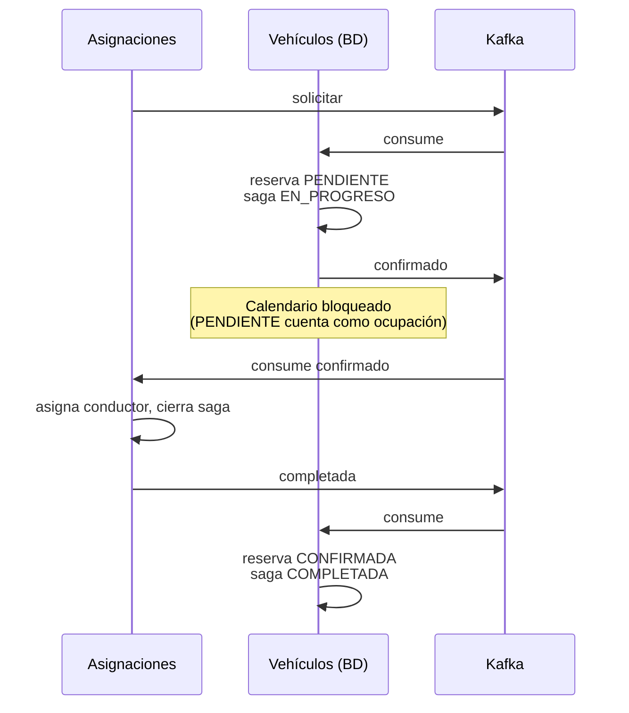
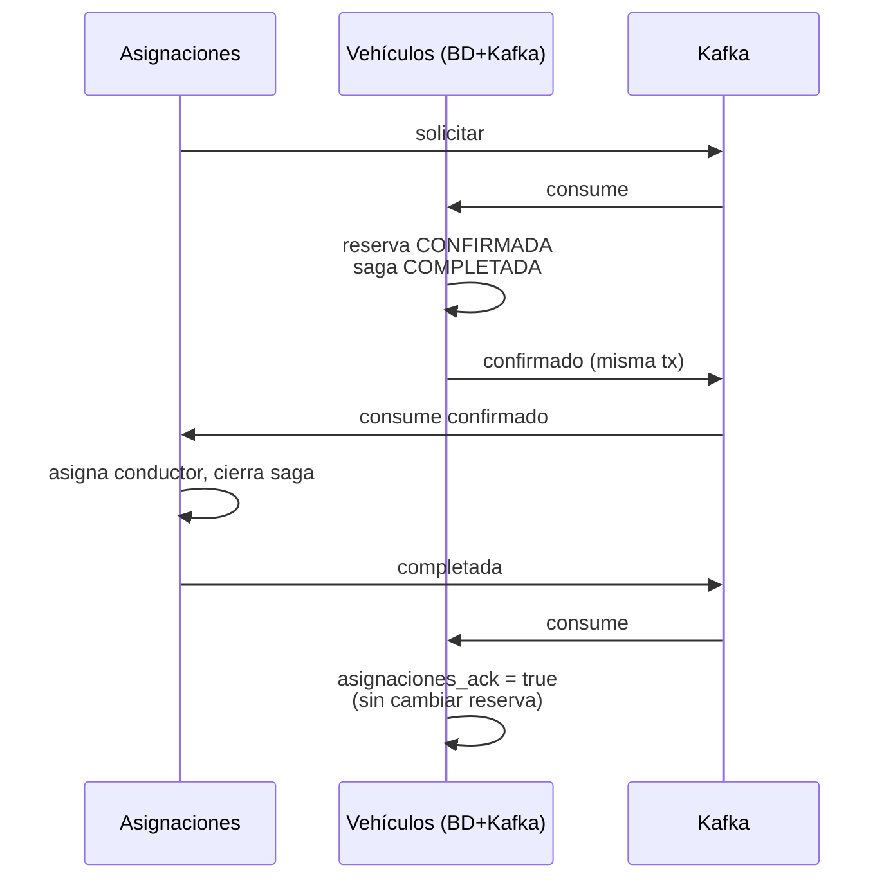

# Contrato dos pasos vs Contrato A+

Documento para el equipo sobre la evolución de la integración Kafka entre **Asignaciones** y **Vehículos**, y por qué se adoptó el **Contrato A+**.

Relacionado: [contrato-kafka.md](contrato-kafka.md) (especificación actual).

Última actualización: julio 2026.

---

## Evolución en tres etapas

| Etapa | Commit aprox. | Idea central |
|-------|---------------|--------------|
| **1. Confirmación inmediata (v1)** | `3311292` | `solicitar` → `CONFIRMADA` + publicar `confirmado` |
| **2. Contrato dos pasos** | `842359a` | `solicitar` → `PENDIENTE` + `confirmado`; `completada` → `CONFIRMADA` |
| **3. Contrato A+** (actual) | `3344f0f` | `solicitar` → `CONFIRMADA` + `confirmado` (atómico); `completada` → solo ACK |

El **contrato dos pasos** fue un arreglo deliberado del equipo: dejó de confirmar en `solicitar` y pasó la confirmación definitiva a `completada`. **A+** no vuelve a la v1 tal cual: confirma en un paso como la v1, pero con semántica distinta en `completada`, transacción atómica DB+Kafka y reconciliación.

---

## 1. Cómo funcionaba el contrato dos pasos

### Flujo



### Qué pasaba en cada evento

| Evento | Estado reserva | Estado saga | Kafka saliente |
|--------|----------------|-------------|----------------|
| `solicitar` | `PENDIENTE` | `EN_PROGRESO` | `confirmado` |
| `completada` | `CONFIRMADA` | `COMPLETADA` | — |
| `liberar` | `CANCELADA` | `COMPENSADA` | — |

### Ejemplo concreto

**Paso 1 — `solicitar`**

```json
{
  "idSaga": "550e8400-e29b-41d4-a716-446655440001",
  "idAsignacion": "660e8400-e29b-41d4-a716-446655440002",
  "tipoVehiculo": "Furgon",
  "fechaInicio": "2026-07-10",
  "fechaFin": "2026-07-15"
}
```

Vehículos:

- Asigna el furgón `ABC-123`
- Guarda reserva en **`PENDIENTE`**
- Saga en **`EN_PROGRESO`**
- Publica `confirmado` con `idVehiculo`

**Paso 2 — Asignaciones procesa y publica `completada`**

```json
{
  "idSaga": "550e8400-e29b-41d4-a716-446655440001",
  "idAsignacion": "660e8400-e29b-41d4-a716-446655440002",
  "idVehiculo": "770e8400-e29b-41d4-a716-446655440003",
  "idConductor": "880e8400-e29b-41d4-a716-446655440004"
}
```

Vehículos (`confirmarReservaPorAsignacion`):

- Pasa reserva a **`CONFIRMADA`**
- Saga a **`COMPLETADA`**

### Intención del diseño dos pasos

La idea era **no comprometer el calendario hasta que Asignaciones cerrara su parte**:

> “Te aparto el vehículo (`PENDIENTE`), te aviso por Kafka (`confirmado`), y solo cuando tú me digas `completada` lo hago oficial (`CONFIRMADA`).”

Eso encaja con un modelo donde Vehículos es cauteloso y Asignaciones tiene la última palabra sobre si la asignación es definitiva.

---

## 2. Cómo funciona el Contrato A+ (actual)

### Flujo



### Qué pasa en cada evento

| Evento | Estado reserva | Estado saga | Otro |
|--------|----------------|-------------|------|
| `solicitar` | `CONFIRMADA` | `COMPLETADA` | Publica `confirmado` en **transacción encadenada** DB+Kafka |
| `completada` | Sin cambio (`CONFIRMADA`) | Sin cambio | `asignaciones_ack = true` |
| Sin ACK tras tiempo | Sin cambio o auto-compensación | — | `SagaReconciliationJob` republica `confirmado` |

### Mismo ejemplo, con A+

Tras `solicitar`, **en un solo paso**:

| Campo | Valor |
|-------|-------|
| `estado_reserva` | `CONFIRMADA` |
| `estado_saga` | `COMPLETADA` |
| `asignaciones_ack` | `false` |
| Kafka | `confirmado` publicado atómicamente |

Tras `completada`:

| Campo | Valor |
|-------|-------|
| `estado_reserva` | `CONFIRMADA` (igual) |
| `asignaciones_ack` | `true` |

---

## 3. Comparación lado a lado

| Dimensión | Dos pasos | Contrato A+ |
|-----------|-----------|-------------|
| **Momento de confirmar calendario** | En `completada` | En `solicitar` |
| **Significado de `confirmado`** | “Te aparté un vehículo (aún pendiente)” | “Vehículo asignado y reserva confirmada” |
| **Significado de `completada`** | **Disparador de negocio** (PENDIENTE→CONFIRMADA) | **ACK técnico** (“recibí tu confirmado”) |
| **Estado saga tras `solicitar`** | `EN_PROGRESO` | `COMPLETADA` |
| **Transacción DB + Kafka** | Separadas (guardar → publicar en otro paso) | `chainedKafkaTransactionManager` (atómico) |
| **Reservas atascadas** | `PENDIENTE` si nunca llega `completada` | `CONFIRMADA` sin ACK; job de reconciliación |
| **Job de limpieza** | `cancelarReservasExpiradas` (timeout PENDIENTE) | `SagaReconciliationJob` (republicar / auto-compensar) |
| **Alineación con Asignaciones `develop`** | Desalineado | Alineado |

---

## 4. Problemas del contrato dos pasos

### 4.1 Contradicción semántica: `confirmado` vs estado interno

En dos pasos se publicaba `confirmado` mientras la reserva seguía en **`PENDIENTE`**.

Para Asignaciones, `confirmado` significa: *“ya tengo vehículo, sigo mi saga”*.  
Para Vehículos internamente significaba: *“aún no es definitivo”*.

Eso genera desincronización de modelos mentales entre equipos y bugs difíciles de depurar.

### 4.2 El calendario ya se bloqueaba igual

La disponibilidad considera **`PENDIENTE` y `CONFIRMADA`** como estados que ocupan el vehículo (`estadosCriticos` en `SagaServiceImpl`).

El dos pasos **no** lograba un “hold suave”: el furgón quedaba bloqueado desde `solicitar`, pero el estado de negocio decía “pendiente”. Coste operativo del bloqueo sin beneficio claro.

### 4.3 Ventana de fallo: `PENDIENTE` eterno

Si `confirmado` llegaba a Asignaciones pero `completada` se perdía (caída, retry, despliegue):

- Asignaciones creía tener vehículo asignado
- Vehículos seguía en `PENDIENTE` / `EN_PROGRESO`
- Hacía falta un job de expiración de PENDIENTE
- APIs como `/reservas/confirmadas` no mostraban la reserva aunque Kafka dijera lo contrario

### 4.4 Publicación Kafka no atómica con la BD

En dos pasos, `VehicleRequestConsumer` hacía:

1. `sagaService.procesarSolicitudAsignacion()` → commit BD
2. `vehicleEventProducer.publishVehicleConfirmed()` → Kafka aparte

Escenarios posibles:

| Fallo | Resultado |
|-------|-----------|
| BD OK, Kafka falla | Reserva `PENDIENTE` sin `confirmado` |
| Kafka OK, BD falla (retry) | Duplicados / estados inconsistentes |

A+ usa `VehicleAssignmentCoordinator` con `chainedKafkaTransactionManager`: o persisten y publican juntos, o rollback de ambos.

### 4.5 Desalineación con Asignaciones `develop`

En `develop`, el flujo de Asignaciones es:

1. Publica `solicitar`
2. Espera `confirmado` / `fallido`
3. Con `confirmado`, asigna conductor y cierra su saga
4. Publica `completada` como **cierre**, no como “permiso para confirmar”

Con dos pasos, Vehículos esperaba que `completada` **autorizara** la confirmación — el sentido del evento estaba invertido respecto a lo que Asignaciones implementó.

---

## 5. Por qué se eligió A+

### Razón 1 — Honestidad del contrato de eventos

| Evento | Mensaje que debe transmitir |
|--------|----------------------------|
| `confirmado` | “El vehículo está asignado y la reserva es firme” |
| `completada` | “Procesé tu `confirmado` y cerré mi saga” |

A+ separa **compromiso de negocio** (`confirmado`) de **acuse de recibo** (`completada`). El dos pasos mezclaba ambos.

### Razón 2 — Un solo paso de negocio, menos estados intermedios

```
Dos pasos:  solicitar → PENDIENTE → completada → CONFIRMADA  (2 transiciones)
A+:         solicitar → CONFIRMADA                          (1 transición)
```

Menos estados intermedios implica:

- Menos endpoints de “bandeja pendiente” con datos reales
- Menos jobs de timeout
- Menos casos borde en idempotencia

### Razón 3 — Reconciliación en el problema correcto

El riesgo real no es “¿confirmamos demasiado pronto?”, sino **“¿el otro servicio recibió el mensaje?”**.

A+ ataca eso con:

- `asignaciones_ack` en saga
- `SagaReconciliationJob` que republica `confirmado`
- Auto-compensación si tras N reintentos no hay ACK
- Métrica `fleetops_reservas_sin_ack_asignaciones`

El dos pasos trataba el mismo riesgo como “esperar `completada` para confirmar”, pero `completada` en Asignaciones **no** es un mecanismo de entrega garantizada de `confirmado`.

### Razón 4 — Consistencia transaccional

A+ introdujo `KafkaConfig` con `JpaTransactionManager` explícito y transacción encadenada. Eso era necesario para un flujo de un paso confiable; el dos pasos seguía con publicación separada.

### Razón 5 — Integración con el resto del ecosistema

Con incidentes (SQS) y `liberar` (Kafka), el flujo queda claro:

```
Incidentes → SQS → cambio de estado operativo (sin tocar reservas)
Asignaciones → liberar → cancelar reserva en calendario
```

Si una reserva sigue en `PENDIENTE` por un `completada` perdido, `liberar` y la disponibilidad se comportan de forma impredecible. Con A+, la reserva ya es `CONFIRMADA` desde el inicio; `liberar` compensa un estado estable.

---

## 6. ¿A+ es “volver atrás” a la confirmación inmediata?

**Parcialmente en forma, no en fondo.**

| | v1 (confirmación inmediata) | Dos pasos | A+ |
|---|---------------------------|-----------|-----|
| Confirma en `solicitar` | Sí | No | Sí |
| `completada` confirma reserva | No | Sí | No (solo ACK) |
| Tx atómica DB+Kafka | No | No | **Sí** |
| Reconciliación por ACK | No | Timeout PENDIENTE | **Sí** |
| Reasignación tras `liberar` | Limitada | Limitada | **`permite_reasignacion`** |

A+ toma lo bueno de “confirmar en `solicitar`” y corrige lo que faltaba en la v1: atomicidad, ACK explícito y reconciliación.

---

## 7. Cuándo tendría sentido el dos pasos

El dos pasos sería razonable si:

- Asignaciones **no** publicara `confirmado` hasta que Vehículos dijera “listo para comprometer”
- Existiera un estado intermedio con **menor** bloqueo de calendario (ej. hold de 5 min reversible sin ocupar slot)
- Vehículos fuera un “catálogo pasivo” y otro servicio validara antes de confirmar

En FleetOps **ninguna** de esas condiciones se cumple: el calendario se bloquea igual con `PENDIENTE`, Asignaciones ya cierra con `completada` tras `confirmado`, y el equipo de Asignaciones en `develop` asume que `confirmado` = vehículo asignado.

---

## 8. Resumen ejecutivo

> **Contrato dos pasos:** “Te aviso por Kafka que tengo vehículo, pero internamente sigo en pendiente hasta que me des permiso con `completada`.”
>
> **Contrato A+:** “Cuando te digo `confirmado`, es definitivo. `completada` solo me confirma que lo recibiste; si no llega, yo reconcilio.”

**Se eligió A+ porque:**

1. Alinea semántica con Asignaciones `develop`
2. Elimina el estado intermedio `PENDIENTE` en el flujo Kafka (sin beneficio real de calendario)
3. Garantiza atomicidad BD + Kafka
4. Mueve la robustez de “esperar un segundo evento de negocio” a “reconciliar entrega de mensajes”
5. Simplifica operación (menos jobs de expiración, estados más claros en APIs y métricas)

---

## Referencias de código

| Componente | Clase |
|------------|-------|
| Coordinator DB+Kafka (A+) | `VehicleAssignmentCoordinator` |
| Consumer solicitar | `VehicleRequestConsumer` |
| Consumer ACK completada | `AssignmentCompletedConsumer` |
| Reconciliación | `SagaReconciliationJob` |
| Lógica saga | `SagaServiceImpl` |
| Kafka config | `KafkaConfig` |

Contrato actual: [contrato-kafka.md](contrato-kafka.md)
